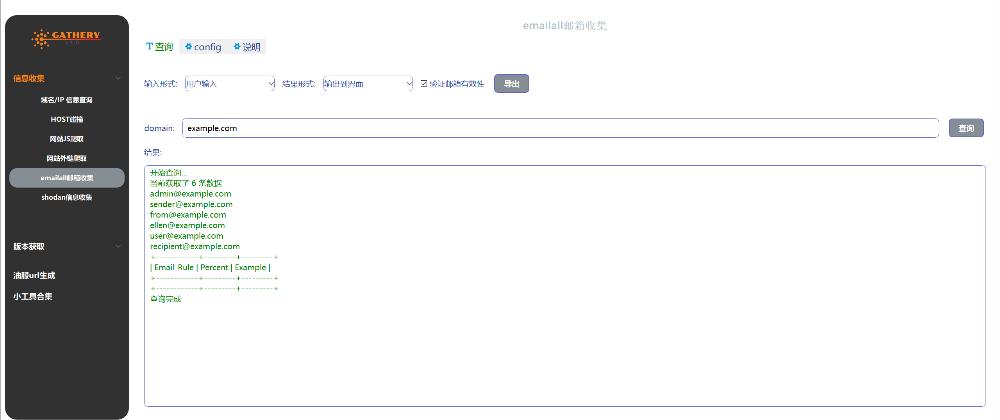

# 1.简介

Gathery 是一款基于 PyQt5 开发的网络安全信息收集与分析工具，集成了多种实用的信息收集功能和小工具，帮助安全研究人员、渗透测试人员和网络管理员快速收集目标信息。（项目地址：https://github.com/fankun99/gathery）

## 2.安装指南

### 2.1 要求

- Python 3.9
- PyQt5

### 2.2 安装步骤

1. 克隆仓库：

   ```
   git clone https://github.com/fankun99/gathery.git
   cd gathery
   ```

2. 安装依赖：

   ```
   pip install -r requirements.txt
   ```

3. 运行程序：

   ```
   python main.py
   ```

# 3.使用说明

### 3.1 信息收集模块

- **Whois查询**：输入域名即时获取注册商、注册日期、过期时间等关键信息。
- **IP反查域名**：
  - 通过一个IP发现关联的所有域名，扩大侦查面
  - 识别共享主机上的其他网站，寻找关联目标
- **Host碰撞**：帮助用户发现非公开入口，如隐藏的管理后台
- **网站JS爬取**：
  - 自动提取JS中的API接口、敏感路径
  - 发现前端硬编码的密钥、密码等
- **网站外链爬取**：
  - 收集网站上的外部链接，帮助用户发现引用的可疑域名或过期服务
  - 收集合作伙伴、供应商等关联方信息
- **邮箱收集**：从网页内容中提取电子邮件地址

### 3.2 Shodan集成

- **Domain解析信息**：获取域名的解析记录
- **IP信息收集**：查询IP的详细信息
- **开放端口扫描**：查找IP开放的端口和服务
- **漏洞检测**：识别已知漏洞

### 3.3 邮件服务器工具

- **Exchange/Zimbra版本获取**：通过URL获取邮件服务器版本信息
- **邮件服务器URL生成**：根据目标域名自动生成常用邮件服务器的URL地址

### 3.4 实用小工具

- **JSON格式化**：美化和格式化JSON数据
- **URL编码/解码**：处理URL编码转换
- **Base64编码/解码**：进行Base64编解码操作
- **文本去重**：去除重复的文本行
- **IP提取**：从文本中自动提取所有IP地址
- **IP段转换**:
  - IP转C段/B段
  - IP段转单个IP列表
- **邮箱提取**：从文本中提取电子邮件地址


## 4.界面截图

### 4.1 whois查询  

### 4.2 IP反查域名

 

### 4.3 外链查询


### 4.4 邮服URL生成


### 4.5 网站JS爬取


### 4.6 emailall-邮箱收集




### 4.7 shaodan信息收集


### 4.8 zimbra版本获取


### 4.9 exchange版本获取


### 4.10 小工具合集

#### (1) **HTTP 请求原始格式** 转python代码


#### (2) Curl转python代码


#### (3) JSON格式化


#### (4) 随机密码生成


## 5.免责声明

本工具仅限用于合法授权的安全测试和研究目的。使用者应遵守法律法规，任何不当使用造成的后果由使用者自行承担。

